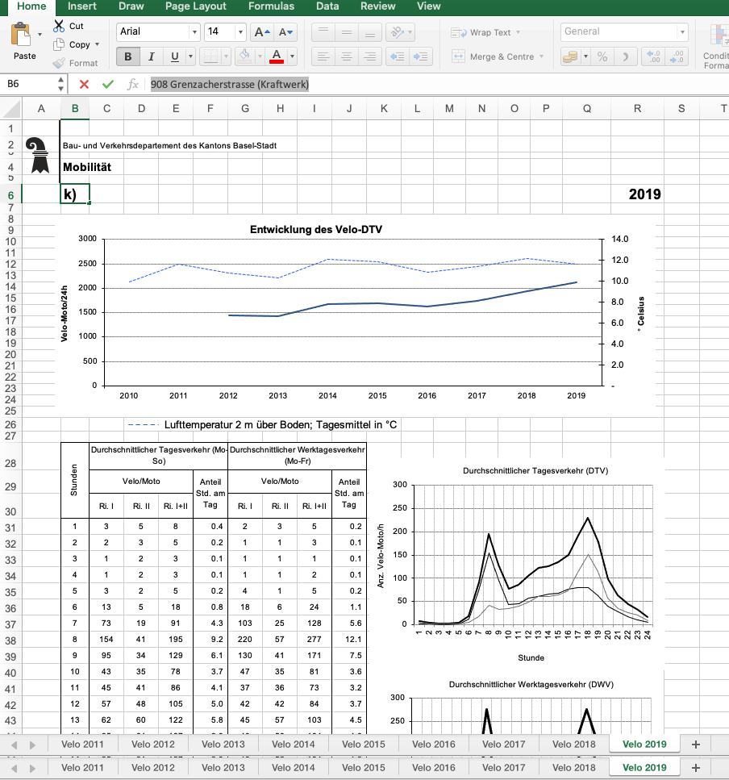

```{r setup, include=FALSE}
library(learnr)
library(tidyverse)
knitr::opts_chunk$set(echo = FALSE)


```
```{r warning=FALSE, echo=FALSE, results='hide', message=FALSE}

df_count_data <- read.csv("data/2021_verkehrszaehlungen_werte_fussgaenger_velo.csv", stringsAsFactors = FALSE)


```

## Welcome

In this tutorial we look at importing data into R.

This tutorials builds on several publicly available tutorials and books. These include:

* [RStudio Primers: Work with Data](https://rstudio.cloud/learn/primers/2)
* Chapter 11 from _R for Data Science_ by Hadley Wickham and Garrett Grolemund, published by O’Reilly Media, Inc., 2016, ISBN: 9781491910399. You can purchase the book at [shop.oreilly.com](http://shop.oreilly.com/product/0636920034407.do). The book is available on as well [here](https://r4ds.had.co.nz/introduction.html)


When working with R, generating empty data frames from scratch or from vectors is something that you will not need in the beginning. Rather, you import data into R for further analysis. 

## Importing text files

To import text files, you can either use the function `read.csv` from base R or `read_csv` from the package `readr`. 


```{r readcsv-example, echo=TRUE}
# Read the data
df_count_data <- read.csv("data/2021_verkehrszaehlungen_werte_fussgaenger_velo.csv", stringsAsFactors = FALSE)

head(df_count_data)

df_count_tibble <- read_csv("data/2021_verkehrszaehlungen_werte_fussgaenger_velo.csv")

df_count_tibble

```

## Spreadsheets

To import Excel files you can use the function `readxl` and `readxlsx` from the package `readxl`. Have a look at the screen shot below of the data stored in the worksheet `Velo_2019` in the range  `C31:I54`. 

```{r fig1, echo = FALSE, out.width = "50%", fig.cap = "Zahlstelle 908 Grenzacherstrasse (Kraftwerk)"}



```

In the code below I specify the range, sheet and column names. 

```{r readxl-example, echo=TRUE}
# Read the data
df_zahlstelle <- readxl::read_xlsx("data/Jahresreport_908.xlsx", sheet='Velo 2019', 
                                  col_names = c("dtv_r1", "dtv_r2","dtv_total","dtv_anteil","dwv_r1", "dwv_r2","dwv_total"),
                                  range='C31:I54')

head(df_zahlstelle)

```

## Spatial data

To import spatial data you can use the function `st_read` from the package `sf`.


```{r readsf-example-shp, echo=TRUE}
# Read the data
library(sf)
sf_canton <- sf::read_sf("data/2021_GEOM_TK 2/GEOM_2021/01_INST/Gesamtfl„che_gf/K4_kant19970101_gf/K4kant19970101gf_ch2007Poly.shp")

plot(sf_canton)

```

## Batch imports

From time to time data is stored in a set of files. Examples include a data sets per year or per location. 

Of course, it would be possible to create a data frame of each data sets and merge the data sets. An example is given in the script below. In the script, two data sets are read with the function `read_csv` and are merged with the function `bind_rows`. This function takes as arguments all the data sets that you would like to merge together. 


```{r read-two-files, echo=TRUE, results='hide'}

# Base directory

df_counts_2019 <- read_csv("data/zrh_verkehrszaehlungen_werte_fussgaenger_velo/aggregated_2019_verkehrszaehlungen_werte_fussgaenger_velo.csv")
df_counts_2020 <- read_csv("data/zrh_verkehrszaehlungen_werte_fussgaenger_velo/aggregated_2020_verkehrszaehlungen_werte_fussgaenger_velo.csv")
df_counts_2021 <- read_csv("data/zrh_verkehrszaehlungen_werte_fussgaenger_velo/aggregated_2021_verkehrszaehlungen_werte_fussgaenger_velo.csv")

df_counts_2019_2020_2021 <- dplyr::bind_rows(df_counts_2019,df_counts_2020,df_counts_2021)


```

However, in reality, you might want to merge a large number of data sets. Specify the name of each file would be cumbersome. Rather, you would like to get all the files in a certain folder and import these files. I'll show this in the subsequent code snippets. 


```{r batch-read-list-files, echo=TRUE}

# Base directory
base_dir <- "data/zrh_verkehrszaehlungen_werte_fussgaenger_velo/"
# The data is stored in different folders
# Create a list of the files from the target directory
df_of_files <- list.files(path=base_dir, recursive = TRUE) %>% 
  data.frame() %>%
  rename(file_name=1) # Rename the first column to 
# If you would like to filter files, you can do so here. 
# Note that the ! indicates not. grepl is a function to check whether a string is in another string. For instance is ap in apple or ba in banana
df_of_files <- df_of_files %>%
  filter(!grepl('~$', file_name, fixed=TRUE)) %>%
  filter(!grepl('Record', file_name, fixed=TRUE))%>%
  data.frame()


```

```{r loop-and-import, echo=TRUE}

  
  list_of_files <- as.list(df_of_files$file_name)


  # Read the first file
  # This is to have a base file to append the remaining files
  file <- list_of_files[1]

  f <- as.character(list_of_files[1]) 
  print(paste("Reading",f,sep=" "))
  
  col_types <- cols(
              FK_ZAEHLER = col_character(),
              year = col_double(),
              month = col_double(),
              day = col_double(),
              hour = col_double(),
              total_fuss = col_double(),
              total_velo = col_double(),
              datum = col_datetime(format = ""))

  
  # Read the first file
  # Set the guess of the data types to a high column
  df <- readr::read_csv(paste0(base_dir,f), guess_max = 100000, col_types = col_types)
  
  # Loop over the files
  # Note that I start at 2 as we already read the first file into the dataframe df
  for (i in 2:length(list_of_files)){
    
    # Get the file from lists
    file <- list_of_files[i]
    f <- as.character(file[1]) 
    print(paste("Reading",f,sep=" "))
    
    df_loop <- readr::read_csv(paste0(base_dir,f), guess_max = 100000, col_types = col_types)
    
    df <- bind_rows(df,df_loop)
  }
  
  df
```


