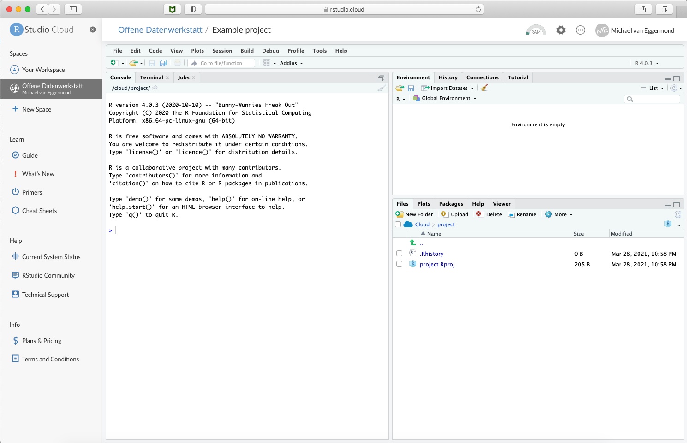
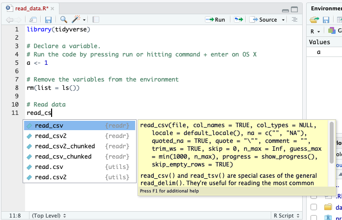

```{r setup, include=FALSE}
library(learnr)
library(tidyverse)
knitr::opts_chunk$set(echo = FALSE)


```

## Welcome

In this tutorial we will be looking at RStudio's interface. More specifically, we will be looking at RStudio Server


## RStudio Interface

The Rstudio server interface consists of the following windows:

* Top-left: Script window, Data Viewer
* Bottom-left: Console, Terminal
* Top-right: Environment
* Bottom-right: Files, Plots, Packages, Help


```{r fig1, echo = FALSE, out.width = "80%", fig.cap = "RStudio Cloud"}



```

### Script window

In the script window, you write your code. You can execute your code by pressing **command+enter** (OS X),  **CTRL+Enter** (Windows) or pressing **Run** in the top bar of the Script window.

When you type code, you will note that, from time to time, RStudio offers suggestions for auto completing code. For instance, when typing `read_csv`. 

```{r fig2, echo = FALSE, out.width = "80%", fig.cap = "Script window"}



```

### Console

The results of the code you run will appear 


## Installing R and RStudio

To follow
