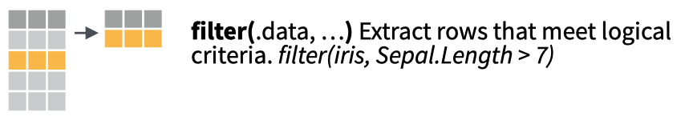
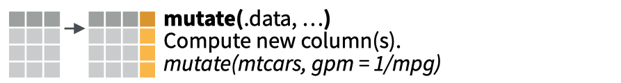
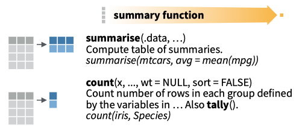
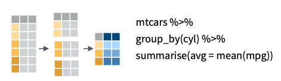

```{css, echo=FALSE}
p.caption {
  font-size: 0.9em;
  font-weight: bold;
  color: grey;
  margin-right: 10%;
  margin-left: 0%;  
  text-align: left;
}
```


```{r setup, include=FALSE, eval=TRUE}
library(learnr)
library(tidyverse)
library(lubridate)
library(scales)

checker <- function(label, user_code, check_code, envir_result, evaluate_result, ...) {
  list(message = check_code, correct = TRUE, location = "append")
}

tutorial_options(exercise.timelimit = 60, exercise.checker = checker)

knitr::opts_chunk$set(echo = FALSE)

# See this issue here: https://github.com/rstudio/learnr/issues/99
#df_counts_zurich <- readr::read_csv("https://www.dropbox.com/s/lp3wcwth65ys468/zurich_aggregated_2018_2021.csv?dl=1")

#df_counts_zurich <- readr::read_csv("https://drive.switch.ch/index.php/s/25ouSzab7H7gtGN/download")

df_counts_zurich <- readr::read_csv("https://drive.google.com/uc?id=1YWGG4-b6p0z4aygsBQMYH68CBsx2IQ1A&export=download") 


#write.csv(tmp.df, "zurich_aggregated_2018_2021.csv", row.names=F)
#rm(list=ls())


```
```{r prepare-counts, warning=FALSE, echo=FALSE,message=FALSE}

# Chunk to prepare the data set for this tutorial
df_counts_zurich <- df_counts_zurich %>%
  dplyr::select(-year,-month,-day)
```


## Introduction

In this tutorial we will look at several commands of the `dplyr` package:

* Selecting data with the `select()` command
* Filtering data with the filtering command `filter()`
* Defining and updating data with the `mutate` command
* Summarizing data with the `summarize()` command
* Grouping data with the `group_by()` command
* Sorting data with the `arrange()` command
* Building pipelines with the `%>%` (pipe) operator


These commands, and other commands from the `dplyr` package are summarized in a cheat sheet. We will show screen grabs from the cheat sheet in this tutorial to explain some concepts. The entire cheat sheet is available here

We will use data downloaded and processed from the Open Data Portal of the municipality of Zurich. This data set contains pedestrian and bicycle counts between 2018 and 2021. The quarterly hour counts have been summed to hourly counts. I added a description of the count location to the data set.

The data set is shown below. It contains the following records:

* **bezeichnung**: Count location
* **fk_standort**: Identifier for the count location
* **fk_zaehler**: Identifier for the count device
* **total_fuss**: Total number of pedestrians
* **total_velo**: Total number of cyclists
* **year**: Year of the count


```{r warning=FALSE, echo=FALSE,message=FALSE}
df_counts_zurich
```

A plot might provide a better impression of the data. I made a plot of selected count locations and aggregated the date per month. 

```{r warning=FALSE, echo=FALSE,message=FALSE}


df_counts_zurich_viz <- df_counts_zurich %>% 
  dplyr::filter(bezeichnung%in%c('Mythenquai',
                                 'Langstrasse (Unterführung Nord)',
                                 'Hardbrücke Süd (Seite HB)',
                                 'Langstrasse (Unterführung Süd)'))%>%
  mutate(year=lubridate::year(datum),
         month=lubridate::month(datum),
         simple_date=lubridate::make_datetime(year=year,month=month),
         velo_korrigiert=total_velo*korrekturfaktor)%>%
  group_by(bezeichnung,simple_date,year,month)%>%
  summarise(sum_velo=sum(velo_korrigiert,na.rm=T))


ggplot(df_counts_zurich_viz,aes(x=simple_date,y=sum_velo))+ 
  geom_line(aes(group = bezeichnung,colour=bezeichnung))+
  scale_x_datetime(date_labels = "%b-%Y",breaks = date_breaks("3 month"))+
  xlab("\nMonth")+
 ylab("Monthly cyclists\n")+ 
  #theme_bw()+
  theme(legend.position="bottom", legend.box="vertical", legend.margin=margin())+
  theme(axis.text.x=element_text(angle=90,hjust=1)) + 
  scale_color_discrete(guide=guide_legend(nrow=2))


```

The raw counts are available at the Open Data Portal of the municiplaity of Zurich [here](https://data.stadt-zuerich.ch/dataset/sid_dav_verkehrszaehlung_miv_od2031). The scripts to convert the raw data to aggregated counts are available on the repository [here](https://github.com/mvaneggermond/OffeneDatenwerkstatt).

This tutorial makes use of the following tutorials:

* Working with data at RStudio Cloud [here]()
* Filters with dplyr [here](https://learnr-examples.shinyapps.io/ex-data-filter/)

## Recap: Data frames & tibbles

### Data frames

In the previous tutorial we looked at data frames, but a brief recap might be in place:

* A data frame consists of rows and columns. 
* All columns in a data frame have the same length; data in each column is of the same data type. 

When conducting exploratory data analysis, some extra definitions are:
* We also refer to the columns as variables: a variable is stored in a column
* Each row contains an observaton (e.g. a set of counts per 15 minutes)
* Each cell contains a value

These concepts are also shown in the figure below.

```{r fig1, echo = FALSE, out.width = "80%", fig.cap = "Data frames, rows and columns"}

knitr::include_graphics("images/df_row_columns.png")

```

Remember, when you are working with data frames, by simply typing the command below, **R** will output all rows of the data frame. In **RStudio** these rows will be outputted in the console pane in the bottom left. 

```{r  warning=FALSE, echo=TRUE,  message=FALSE,results='hide'}

df_counts_zurich

```

```{r fig2, echo = FALSE, out.width = "80%", fig.cap = "Output of the command df_counts_zurich"}

knitr::include_graphics("images/example_df.png")

```

If you would like to view the first rows of your data frame, use the command `head(your_df_name)`, **R** will output the first rows of the data frame. In **RStudio** these rows will be outputted in the console pane in the bottom left. 


```{r fig3, echo = FALSE, out.width = "80%", fig.cap = "Output of the command head(df_counts_zurich)"}

knitr::include_graphics("images/example_head_df.png")

```

If you would like to view the entire data frame, use the command `View(your_df_name)`, **RStudio** will open a new pane in the top right window.


```{r fig4, echo = FALSE, out.width = "80%", fig.cap = "Output of the command View(df_counts_zurich)"}

knitr::include_graphics("images/example_view_df.png")

```

### Tibble

A tibble is a special type of table.R will print only the first ten rows of a tibble as well as all of the columns that fit into your console window. R also adds useful summary information about the tibble, such as the data types of each column and the size of the data set. When you are working with the `tidyverse` packages, data frames will often be converted to `tibbles`.  

You can change a data frame to a tibble by running the command below. 

```{r warning=FALSE, echo=TRUE,  message=FALSE,results='hide'}

tibble_counts_zurich <- tibble::as_tibble(df_counts_zurich)


```

If you would like to view the contents of the tibble, simply type the command below. You see that only a limited number of columns are shown, a limited number of rows and the data type of each column. This is very useful when working with data in R. 

```{r warning=FALSE, echo=TRUE,  message=FALSE,results='hide'}

tibble_counts_zurich 

```

```{r fig5, echo = FALSE, out.width = "80%", fig.cap = "Output of the command View(df_counts_zurich)"}

knitr::include_graphics("images/example_tibble.png")

```
If you would like to change the `tibble` back to a data frame, simply use the code below. 

```{r warning=FALSE, echo=TRUE,  message=FALSE,results='hide'}

df_counts_zurich <- as.data.frame(tibble_counts_zurich)

```
Tibbles are data frames, but an enhanced type of data frame. You will find out that some packages do not like to work with tibbles yet, but converting between data frames and tibbles is very easy!

## Select & relocate
### select()
`select()` extracts columns of a data frame and returns the columns as a new data frame. To use select(), pass it the name of a data frame to extract columns from, and then the names of the columns to extract. The column names do not need to appear in quotation marks or be prefixed with a $; select() knows to find them in the data frame that you supply.

The extract below from the dplyr cheat sheet depicts the concept of selecting columns and parsing these to new data frame. 


```{r fig6, echo = FALSE, out.width = "50%", fig.cap = "Selecting columns"}

knitr::include_graphics("images/select.png")

```

With the code snippet below you select the column `bezeichnung` from the data frame `df_counts_zurich`. Can you try the following as well:

1. Select the column **fk_standort**
2. Select the columns **datum**,  **total_velo** and**total_fuss**


```{r select-1, exercise = TRUE, exercise.eval = FALSE, exercise.setup = 'prepare-counts',results = "asis"}
select(df_counts_zurich,bezeichnung)
```


```{r select-1-solution}
select(df_counts_zurich, FK_STANDORT)
select(df_counts_zurich, datum,total_velo,total_fuss)
```

The official documentation of the `select()` command is available [here](https://dplyr.tidyverse.org/reference/select.html). This documentation also contains several examples. 

### relocate()

You can use the command relocate to change the order of the columns in your data frame. This is handy with larger data frames, or if you want to view the values of a certain columns that are not adjacent to each other. 


```{r relocate-1, exercise = TRUE, exercise.eval = FALSE, exercise.setup = 'prepare-counts',results = "asis"}
relocate(df_counts_zurich,datum)
```

```{r relocate-1-solution}
relocate(df_counts_zurich,datum)
```

The official documentation of the `relocate()` command is available [here](https://dplyr.tidyverse.org/reference/relocate.html). This documentation also contains several examples. 

## Filter

`filter()` lets you use a logical test to extract specific rows from a data frame. To use `filter()`, pass it the data frame followed by one or more logical tests. `filter()` will return every row that passes each logical test.

The graphic below shows this in more detail.


```{r fig7, echo = FALSE, out.width = "50%", fig.cap = "Filtering columns"}



```


Recall that we looked at the logical operators listed in the table below. 

Operator Description
-------- -----------
\>       Greater than
\>\=     Greater than or equal to 
\<       Less than
\<\=     Less than or equal to 
==       Exactly equal to
!=       Not equal to

In addition to these operators, the following boolean operators are useful when working with filters:

Operator Description
-------- -----------
&        And
|        Or
!        Not
%in%     Check whether a value is in a vector.

### A first example

We can use `filter()` to select every day that had more than 1000 cylists passing. Click Submit Answer to give it a try. Can you try the following: 

1. Filter the count locations that had more than 1000 pedestrians passing (hint: use the column **total_fuss**)
2. Filter the count location named `Mythenquai`. Recall that you have to use `"` around strings and have a close look at the **Equals** operator in the table above (hint: use the column **bezeichnung**). 

```{r filter-1, exercise = TRUE, exercise.eval = FALSE, exercise.setup = 'prepare-counts',results = "asis"}
filter(df_counts_zurich, total_velo > 100 )
```


```{r filter-1-solution}
filter(df_counts_zurich, total_fuss > 1000 )
filter(df_counts_zurich, bezeichnung =="Mythenquai" )

```

When you start out with R, the easiest mistake to make is to test for equality with `=` instead of `==`. When this happens you'll get an informative error.

###  Output

Like all dplyr functions, `filter()` returns a new data frame for you to save or use. It doesn't overwrite the old data frame. 

If you want to save the output of `filter()`, you'll need to use the assignment operator, `<-`. 

Rerun the command in the code chunk below, but first arrange to save the output to an object named `df_counts_mythenquai`.

```{r filter, exercise = TRUE, exercise.eval = FALSE, exercise.setup = 'prepare-counts',results = "asis"}
filter(df_counts_zurich, bezeichnung =="Mythenquai" )
```

```{r filter-solution}
df_counts_mythenquai <- filter(df_counts_zurich, bezeichnung =="Mythenquai" )
```

### Multiple tests
If you give `filter()` more than one logical test, `filter()` will combine the tests with an implied "and." In other words, `filter()` will return only the rows that return `TRUE` for every test. You can combine tests in other ways with Boolean operators... 

```{r filter-multiple, exercise = TRUE, exercise.eval = FALSE, exercise.setup = 'prepare-counts',results = "asis"}
filter(df_counts_zurich, bezeichnung =="Mythenquai", total_velo>400)
```


### Using boolean operators

Instead of using multiple `and` filters, you can use boolean operators. In the `filter` function, you can use the following boolean operators: 

Operator Description
-------- -----------
&        And
|        Or
!        Not
!=       Not equals to
%in%     Check whether a value is in a vector.

These operators are executed on a row-by-row basis. 

Have a look at the statement in the exercise below. With this statement you select the count locations (`bezeichnung`) called Mythenquai and have a count higher than 1,000.

```{r filter-multiple-boolean, exercise = TRUE, exercise.eval = FALSE, exercise.setup = 'prepare-counts',results = "asis"}
filter(df_counts_zurich, bezeichnung =="Mythenquai" & total_velo>1000)
```

Compare the difference when you are the OR operator `|`. Now, we select the count locations called Mythenquai or count locations that have a count higher than 1,000.

```{r filter-multiple-boolean-or, exercise = TRUE, exercise.eval = FALSE, exercise.setup = 'prepare-counts',results = "asis"}
filter(df_counts_zurich, bezeichnung =="Mythenquai" | total_velo>1000)
```

Can you change the command below to select the count locations other than Mythenquai, or in other words, are not equal to Mythenquai?

```{r filter-multiple-boolean-not, exercise = TRUE, exercise.eval = FALSE, exercise.setup = 'prepare-counts',results = "asis"}
filter(df_counts_zurich, bezeichnung =="Mythenquai")
```

```{r filter-multiple-boolean-not-solution}
filter(df_counts_zurich, bezeichnung !="Mythenquai")
```

### %in%

Finally, I would like to take a look at the `%in%` operator. With this operator, you can select whether a element is contained in a vector. This is best explained by an example. 

Imagine we would like to analyse the count locations named:  `'Mythenquai', 'Langstrasse (Unterführung Nord)', 'Hardbrücke Süd (Seite HB)',  'Langstrasse (Unterführung Süd)'`.

We have learned that we could use multiple **OR** (`|`) statements. Another possiblitiy is to define a vector first, and check whether count location is contained in this vector. One advantage of this approach is that you can easily reuse and change this vector without changing other code. I'll show this in the example below:

```{r filter-multiple-boolean-in, exercise = TRUE, exercise.eval = FALSE, exercise.setup = 'prepare-counts',results = "asis"}
my_filter <- c('Mythenquai', 'Langstrasse (Unterführung Nord)','Hardbrücke Süd (Seite HB)','Langstrasse (Unterführung Süd)')

filter(df_counts_zurich, bezeichnung %in% my_filter)

```

Again, the `%in%` works in conjuction with the **NOT** (`!`) operator, but in a special way. You place the  **NOT** (`!`) operator before the variable you would like to filter. In this case, I have placed it before the variable `bezeichnung`. 
```{r filter-multiple-boolean-not-in, exercise = TRUE, exercise.eval = FALSE, exercise.setup = 'prepare-counts',results = "asis"}
my_filter <- c('Mythenquai', 'Langstrasse (Unterführung Nord)','Hardbrücke Süd (Seite HB)','Langstrasse (Unterführung Süd)')

filter(df_counts_zurich, !bezeichnung %in% my_filter)
```

If you would like to learn more about `filter()` I can recommend this tutorial [here](https://learnr-examples.shinyapps.io/ex-data-filter/). The documentation of the function `filter()` is available [here](https://dplyr.tidyverse.org/reference/filter.html). 


## Arrange

`arrange()` returns all of the rows of a data frame reordered by the values of a column. As with `select()`, the first argument of `arrange()` should be a data frame and the remaining arguments should be the names of columns. If you give `arrange()` a single column name, it will return the rows of the data frame reordered so that the row with the lowest value in that column appears first, the row with the second lowest value appears second, and so on. If the column contains character strings, `arrange()` will place them in alphabetical order.

### Exercise - arrange()

Use the code chunk below to arrange the data set `df_counts_zurich` by `datum`. Can you tell when the data set started?

```{r arrange-1, exercise = TRUE, exercise.setup = "prepare-counts"}
#arrange(df_counts_zurich, datum)

```

### Changing the order
If you would rather arrange rows in the opposite order, i.e. from _large_ values to _small_ values, surround a column name with `desc()`. `arrange()` will reorder the rows based on the largest values to the smallest.

Have a look at the example below.

```{r arrange-3, exercise = TRUE, exercise.eval = TRUE}
arrange(df_counts_zurich, desc(total_velo))
```

### Learn more

The official documentation for `arrange` can be found [here](https://dplyr.tidyverse.org/reference/arrange.html).

## Mutate

With `mutate()` you can adds new variables to your data set based on existing variables in your data. Common examples calculating the ratio between two variables, calculating the elapsed time, etc., etc.. The figure below highlights this calculation. Mutate operates on row: unless a function explicity works on a vector, it will conduct the calculations on a row basis. 

```{r fig8, echo = FALSE, out.width = "50%", fig.cap = "Mutate columns"}



```

### An example

If you would like to calculate the sum of `total_fuss` and `total_velo` you define a new variable, in this case `total` and you sum the two variables. 

```{r mutate-1, exercise = TRUE, exercise.eval = TRUE}

 mutate(df_counts_zurich,total=total_fuss+total_velo)
```

The column `korrekurfaktor` indicates by how much the columns should be multiplied (`*`) to obtain the correct count. Can you calculate the following:

* The corrected number of pedestrians
* The corrected number of cyclists

Start by copying the code above in the box below.

```{r mutate-2, exercise = TRUE, exercise.eval = TRUE}


```

```{r mutate-2-solution}
 mutate(df_counts_zurich,corrected_velo=korrekturfaktor*total_velo)
 mutate(df_counts_zurich,corrected_fuss=korrekturfaktor*total_fuss)

```

### Mutate with if / else and case / when

Two functions are frequently used with mutate. These are `if_else()` and `case_when()`. These functions run a logical test and have two respectively multiple return types. 

For instance, it can be that you would like to shorten the name of a count location in certain cases. In this case, you can use `if_else` to return a shortened name in some cases, but not all.  

Have a close look at the function below. This function checks the name of the column `bezeichnung`. If this is `Altstetterstrasse Ost` then it will return `'Altstetterstrasse'` else it will return the variable `bezeichung`.  

```{r mutate-if, exercise = TRUE, exercise.eval = TRUE}

mutate(df_counts_zurich,bezeichnung_short=if_else(bezeichnung=='Altstetterstrasse Ost','Altstetterstrasse', bezeichnung))
```

With the function `case_when()` you can run multiple if else statements. The statement will exit the first time a `TRUE` case is encountered.

Have a close look at the function below. This function checks the name of the column `bezeichnung`. If this is `Altstetterstrasse Ost` then it will return the string `Altstetterstrasse`, then, if the name `Altstetterstrasse West`, it will return the string `Altstetterstrasse`. Otherwise it will return the variable `bezeichnung`

```{r mutate-case, exercise = TRUE, exercise.eval = TRUE}

mutate(df_counts_zurich,bezeichnung_short=case_when(bezeichnung=='Altstetterstrasse Ost' ~ 'Altstetterstrasse',
                                                    bezeichnung=='Altstetterstrasse West' ~ 'Altstetterstrasse',
                                                    TRUE ~ bezeichnung))
```

Documentation for `if_else()` is available [here](https://dplyr.tidyverse.org/reference/if_else.html). Documentation for `case_when()` is available [here](https://dplyr.tidyverse.org/reference/case_when.html)

### Using other functions when mutating

It is possible to use a wide range of other functions from different libraries. You can even write your own functions! I frequently use functions from the packages `lubridate` and `stringr`. With these packages you can perform operations on dates resp. strings. 

In the code block below I extract the year and month - something very useful for aggregation and filtering. 

Can you try to extract the following:

* Quarter
* Day
* Hour

```{r mutate-lubridate, exercise = TRUE, exercise.eval = TRUE}

 mutate(df_counts_zurich,year=lubridate::year(datum),
         month=lubridate::month(datum))
```

```{r mutate-lubridate-solution, exercise = TRUE, exercise.eval = TRUE}

 mutate(df_counts_zurich,year=lubridate::year(datum),
         month=lubridate::month(datum),
          quarter=lubridate::quarter(datum),
         day=lubridate::day(datum),
         hour=lubridate::hour(datum),
        weekday=lubridate::wday(lubridate::ymd(datum), week_start = 1,label=TRUE,abbr= FALSE))


```


## Pipe

Notice how each dplyr function takes a data frame as input and returns a data frame as output. This makes the functions easy to use in a step by step fashion. For example, you could:

1. Add column for year, month, day
2. Filter the observations based on the name and year
3. Calculate the corrected count
4. Select the year, month, nad
4. Arrange those columns so that the most popular busy count days appear near the top.

```{r echo = TRUE}
df_counts_processed <- mutate(df_counts_zurich, 
                              year=lubridate::year(datum),
                               month=lubridate::month(datum),day=lubridate::month(datum), 
                               weekday=lubridate::wday(lubridate::ymd(datum), label=TRUE,abbr= FALSE))
df_counts_processed <- filter(df_counts_processed, year==2020,bezeichnung=="Mythenquai")
df_counts_processed <- mutate(df_counts_processed, corrected_count_velo=korrekturfaktor*total_velo)
df_counts_processed <- select(df_counts_processed, datum,month, day,weekday,corrected_count_velo)
df_counts_processed <- arrange(df_counts_processed,desc(corrected_count_velo))


df_counts_processed %>% as_tibble()
```

The pipe operator `%>%` performs an extremely simple task: it passes the result on its left into the first argument of the function on its right. Or put another way, `x %>% f(y)` is the same as `f(x, y)`. This piece of code punctuation makes it easy to write and read series of functions that are applied in a step by step way. For example, we can use the pipe to rewrite our code above:

```{r echo = TRUE}
df_counts_zurich %>% 
  mutate(year=lubridate::year(datum),
         month=lubridate::month(datum),day=lubridate::month(datum), 
         weekday=lubridate::wday(lubridate::ymd(datum), label=TRUE,abbr= FALSE))%>%
  filter(year==2020,bezeichnung=="Mythenquai") %>% 
  mutate(corrected_count_velo=korrekturfaktor*total_velo)%>%
  select(month, day,weekday,corrected_count_velo)%>%
  arrange(desc(corrected_count_velo))
```

As you read the code, pronounce `%>%` as "then". You'll notice that dplyr makes it easy to read pipes. Each function name is a verb, so our code resembles the statement, "Take df_counts_zurich, _then_ filter it by year and location, _then_ select the  columns, _then_ arrange the results by descending values of the counts."

dplyr also makes it easy to write pipes. Each dplyr function returns a data frame that can be piped into another dplyr function, which will accept the data frame as its first argument. In fact, dplyr functions are written with pipes in mind: each function does one simple task. dplyr expects you to use pipes to combine these simple tasks to produce sophisticated results.

### Exercise - Pipes

I'll use pipes for the remainder of the tutorial, and I will expect you to as well. Let's practice a little by writing a new pipe in the chunk below. The pipe should:

1. Filter the counts to just the counts conducted at `Langstrasse (Unterführung Nord)`
2. Select the `total_velo` and date columns
3. Arrange the results so that the most popular count location are near the top.

Try to write your pipe without copying and pasting the code from above.

```{r pipe, exercise = TRUE, exercise.eval = TRUE}


```

## Summarise & Group by


### Summarise

If you just want to know the number of observations in your data you can use the function `count()`.  With `summarise()` you can produce summaries of the average, sum, standard deviation, minimum, maximum of the data,. To use the function you just add your new column name, and after the equal sign the mathematics of what needs to happen: `new_column_name = function(variable)`. You can add multiple summary functions behind each other. Common functions are `mean()`, `sd()` and `n()`. 

```{r fig9, echo = FALSE, out.width = "50%", fig.cap = "Summarise columns"}



```

Have a look at the code below. Here, we calculate the number observations in the data set as well as the average number of cyclists. 

Can you try the following:

* Calculate the `max()` and `min()` number of cyclists?
* Calculate the `max()` and `min()` number of pedestrians?
* Calculate the total number of pedestrians and cyclists with `sum()`?


```{r summarise, exercise=TRUE}
df_counts_zurich %>% 
  summarise(n=n(), average=mean(total_velo))
```

```{r summarise-solution}
df_counts_zurich %>% 
  summarise(n=n(), 
            average=mean(total_velo),
              min=max(total_velo),
              max=max(total_velo),
            average_fuss=mean(total_fuss),
              min_fuss=max(total_fuss),
              max_fuss=max(total_fuss)  )
```

### Group by

In most cases, you do not just want to summarise the whole data set, but obtain summaries by a group. To do this, you first need to specify by which variable(s) you want to divide the data using `group_by()`. You can add one of more variables as arguments in `group_by()`. The image below shows an excerpt of the cheat sheet for `group_by()`.

```{r fig10, echo = FALSE, out.width = "50%", fig.cap = "Group columns"}



```

Can you try the following:

* Add a column year to the data set, group by year and calculate the total number?
* Sort this total year and total cyclists

```{r group_by, exercise=TRUE}
df_counts_zurich %>% 
  group_by(bezeichnung)%>%
  summarise(n=n(), average=mean(total_velo), sum=sum(total_velo))
```


```{r group_by-solution}
df_counts_zurich %>% 
  mutate(year=lubridate::year(datum))%>%
  group_by(bezeichnung,year)%>%
  summarise(n=n(), average=mean(total_velo), sum=sum(total_velo)) %>%
  arrange(desc(year),desc(sum))
```
