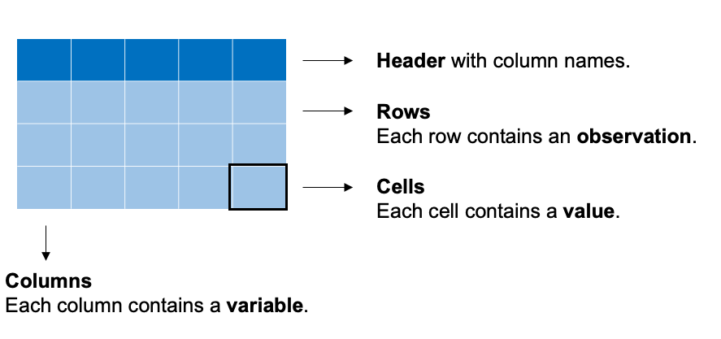
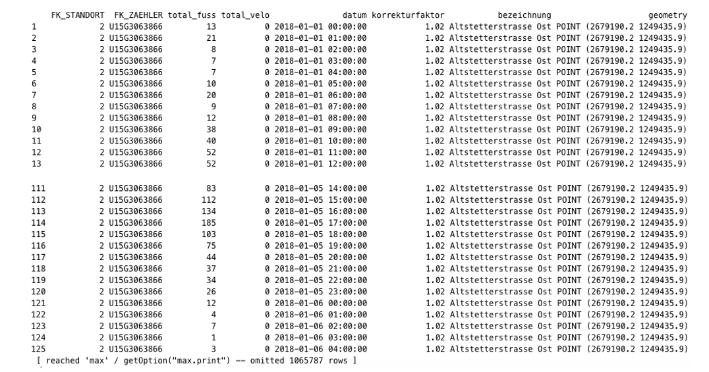
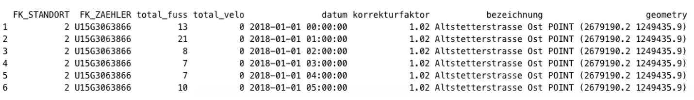
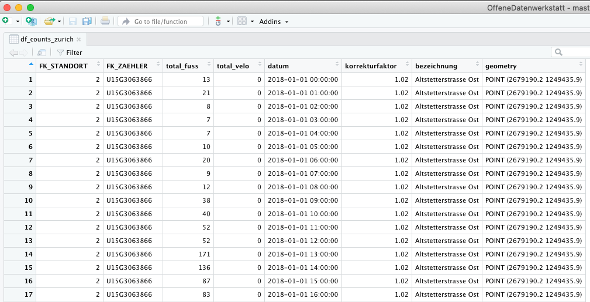
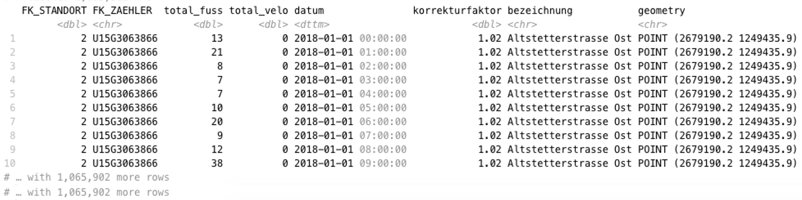
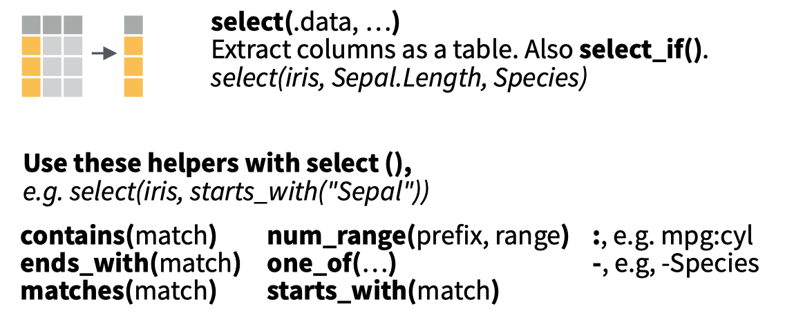

```{css, echo=FALSE}
p.caption {
  font-size: 0.9em;
  font-weight: bold;
  color: grey;
  margin-right: 10%;
  margin-left: 0%;  
  text-align: left;
}
```


```{r setup, include=FALSE, eval=TRUE}
library(learnr)
library(tidyverse)
library(lubridate)
library(scales)

checker <- function(label, user_code, check_code, envir_result, evaluate_result, ...) {
  list(message = check_code, correct = TRUE, location = "append")
}

tutorial_options(exercise.timelimit = 60, exercise.checker = checker)

knitr::opts_chunk$set(echo = FALSE)

# See this issue here: https://github.com/rstudio/learnr/issues/99
df_counts_zurich <- readr::read_csv("https://www.dropbox.com/s/lp3wcwth65ys468/zurich_aggregated_2018_2021.csv?dl=1")

#write.csv(tmp.df, "zurich_aggregated_2018_2021.csv", row.names=F)
#rm(list=ls())


```
```{r prepare-counts, warning=FALSE, echo=FALSE,message=FALSE}

# Chunk to prepare the data set for this tutorial
df_counts_zurich <- df_counts_zurich %>%
  dplyr::select(-year,-month,-day)


```

```{r, context = "render", results = 'asis', echo = FALSE}
tryCatch(
  source("https://metrics.rstudioprimers.com/learnr/installClient", local=TRUE)$value,
  error = function(e){ 
    print("Warning: An error occurred with the client code.")
  }
)
```


## Introduction

In this tutorial we will look at several commands of the `dplyr` package:

* Selecting data with the `select` command
* Filtering data with the filtering command `filter`
* Summarizing data with the `summarize` command
* Grouping data with the `group_by` command
* Sorting data with the `arrange` command
* Defining and updating data with the `mutate` command

These commands, and other commands from the `dplyr` package are summarized in a cheat sheet. We will show screengrabs from the cheat sheet in this tutorial to explain some concepts. The entire cheat sheet is available here

We will use data downloaded and processed from the Open Data Portal of the municipality of Zurich. This data set contains pedestrian and bicycle counts between 2018 and 2021. The quarterly hour counts have been summed to hourly counts. I added a description of the count location to the data set.

The data set is shown below. It contains the following records:

* **bezeichnung**: Count location
* **fk_standort**: Identifi

```{r warning=FALSE, echo=FALSE,message=FALSE}
df_counts_zurich %>% relocate(bezeichnung)
```

A plot might provide a better impression of the data. I made a plot of selected count locations and aggregated the date per month. 

```{r warning=FALSE, echo=FALSE,message=FALSE}


df_counts_zurich_viz <- df_counts_zurich %>% 
  dplyr::filter(bezeichnung%in%c('Mythenquai',
                                 'Langstrasse (Unterführung Nord)',
                                 'Hardbrücke Süd (Seite HB)',
                                 'Langstrasse (Unterführung Süd)'))%>%
  mutate(year=lubridate::year(datum),
         month=lubridate::month(datum),
         simple_date=lubridate::make_datetime(year=year,month=month),
         velo_korrigiert=total_velo*korrekturfaktor)%>%
  group_by(bezeichnung,simple_date,year,month)%>%
  summarise(sum_velo=sum(velo_korrigiert,na.rm=T))


ggplot(df_counts_zurich_viz,aes(x=simple_date,y=sum_velo))+ 
  geom_line(aes(group = bezeichnung,colour=bezeichnung))+
  scale_x_datetime(date_labels = "%b-%Y",breaks = date_breaks("3 month"))+
  xlab("\nMonth")+
 ylab("Monthly cyclists\n")+ 
  #theme_bw()+
  theme(legend.position="bottom", legend.box="vertical", legend.margin=margin())+
  theme(axis.text.x=element_text(angle=90,hjust=1)) + 
  scale_color_discrete(guide=guide_legend(nrow=2))


```

The raw counts are available at the Open Data Portal of the municiplaity of Zurich [here](https://data.stadt-zuerich.ch/dataset/sid_dav_verkehrszaehlung_miv_od2031). The scripts to convert the raw data to aggregated counts are available on the repository [here](https://github.com/mvaneggermond/OffeneDatenwerkstatt).

## Recap: Data frames & tibbles

### Data frames

In the previous tutorial we looked at data frames, but a brief recap might be in place:

* A data frame consists of rows and columns. 
* All columns in a data frame have the same length; data in each column is of the same data type. 

When conducting exploratory data analysis, some extra definitions are:
* We also refer to the columns as variables: a variable is stored in a column
* Each row contains an observaton (e.g. a set of counts per 15 minutes)
* Each cell contains a value

These concepts are also shown in the figure below.

```{r fig1, echo = FALSE, out.width = "80%", fig.cap = "Data frames, rows and columns"}



```

Remember, when you are working with data frames, by simply typing the command below, **R** will output all rows of the data frame. In **RStudio** these rows will be outputted in the console pane in the bottom left. 

```{r  warning=FALSE, echo=TRUE,  message=FALSE,results='hide'}

df_counts_zurich

```

```{r fig2, echo = FALSE, out.width = "80%", fig.cap = "Output of the command df_counts_zurich"}



```

If you would like to view the first rows of your data frame, use the command `head(your_df_name)`, **R** will output the first rows of the data frame. In **RStudio** these rows will be outputted in the console pane in the bottom left. 


```{r fig3, echo = FALSE, out.width = "80%", fig.cap = "Output of the command head(df_counts_zurich)"}



```

If you would like to view the entire data frame, use the command `View(your_df_name)`, **RStudio** will open a new pane in the top right window.


```{r fig4, echo = FALSE, out.width = "80%", fig.cap = "Output of the command View(df_counts_zurich)"}



```

### Tibble

A tibble is a special type of table.R will print only the first ten rows of a tibble as well as all of the columns that fit into your console window. R also adds useful summary information about the tibble, such as the data types of each column and the size of the data set. When you are working with the `tidyverse` packages, data frames will often be converted to `tibbles`.  

You can change a data frame to a tibble by running the command below. 

```{r warning=FALSE, echo=TRUE,  message=FALSE,results='hide'}

tibble_counts_zurich <- tibble::as_tibble(df_counts_zurich)


```

If you would like to view the contents of the tibble, simply type the command below. You see that only a limited number of columns are shown, a limited number of rows and the data type of each column. This is very useful when working with data in R. 

```{r warning=FALSE, echo=TRUE,  message=FALSE,results='hide'}

tibble_counts_zurich 

```

```{r fig5, echo = FALSE, out.width = "80%", fig.cap = "Output of the command View(df_counts_zurich)"}



```
If you would like to change the `tibble` back to a data frame, simply use the code below. 

```{r warning=FALSE, echo=TRUE,  message=FALSE,results='hide'}

df_counts_zurich <- as.data.frame(tibble_counts_zurich)

```
Tibbles are data frames, but an enhanced type of data frame. You will find out that some packages do not like to work with tibbles yet, but converting between data frames and tibbles is very easy!

## Select & relocate
### select()
`select()` extracts columns of a data frame and returns the columns as a new data frame. To use select(), pass it the name of a data frame to extract columns from, and then the names of the columns to extract. The column names do not need to appear in quotation marks or be prefixed with a $; select() knows to find them in the data frame that you supply.

The extract below from the dplyr cheat sheet depicts the concept of selecting columns and parsing these to new data frame. 


```{r fig6, echo = FALSE, out.width = "50%", fig.cap = "Selecting columns"}



```

With the code snippet below you select the column `bezeichnung` from the data frame `df_counts_zurich`. Can you try the following as well:

1. Select the column **FK_STANDORT**
2. Select the columns **datum**,  **total_velo** and ,  **total_fuss**


```{r select-1, exercise = TRUE, exercise.eval = FALSE, exercise.setup = 'prepare-counts',results = "asis"}
select(df_counts_zurich,bezeichnung)
```


```{r select-1-solution}
select(df_counts_zurich, FK_STANDORT)
select(df_counts_zurich, datum,total_velo,total_fuss)
```

The official documentation of the `select` command is available [here](https://dplyr.tidyverse.org/reference/select.html). This documentation also contains several examples. 

### relocate()

```{r relocate-1, exercise = TRUE, exercise.eval = FALSE, exercise.setup = 'prepare-counts',results = "asis"}
relocate(df_counts_zurich,datum)
```


## Filter

`filter()` lets you use a logical test to extract specific rows from a data frame. To use `filter()`, pass it the data frame followed by one or more logical tests. `filter()` will return every row that passes each logical test.

Recall that we looked at the logical operators listed in the table below. 

Operator Description
-------- -----------
\>       Greater than
\>\=     Greater than or equal to 
\<       Less than
\<\=     Less than or equal to 
==       Exactly equal to
!=       Not equal to

In additon to these operators, several other operators are useful as well when using filter. 

Operator Description
-------- -----------
!        Not
%in%     Check whether a value is in a vector.
&        And
|        Or

### A first example

We can use `filter()` to select every day that had more than 1000 cylists passing. Click Submit Answer to give it a try. Can you try the following: 

1. Filter the count locations that had more than 1000 pedestrians passing (hint: use the column **total_fuss**)
2. Filter the count location named `Mythenquai`. Recall that you have to use `"` around strings and have a close look at the **Equals** operator in the table above (hint: use the column **bezeichnung**). 

```{r filter-1, exercise = TRUE, exercise.eval = FALSE, exercise.setup = 'prepare-counts',results = "asis"}
filter(df_counts_zurich, total_velo > 100 )
```


```{r filter-1-solution}
filter(df_counts_zurich, total_fuss > 1000 )
filter(df_counts_zurich, bezeichnung =="Mythenquai" )

```

When you start out with R, the easiest mistake to make is to test for equality with `=` instead of `==`. When this happens you'll get an informative error.

###  Output

Like all dplyr functions, `filter()` returns a new data frame for you to save or use. It doesn't overwrite the old data frame. 

If you want to save the output of `filter()`, you'll need to use the assignment operator, `<-`. 

Rerun the command in the code chunk below, but first arrange to save the output to an object named `df_counts_mythenquai`.

```{r filter, exercise = TRUE, exercise.eval = FALSE, exercise.setup = 'prepare-counts',results = "asis"}
filter(df_counts_zurich, bezeichnung =="Mythenquai" )
```

```{r filter-solution}
df_counts_mythenquai <- filter(df_counts_zurich, bezeichnung =="Mythenquai" )
```

### Multiple tests
If you give `filter()` more than one logical test, `filter()` will combine the tests with an implied "and." In other words, `filter()` will return only the rows that return `TRUE` for every test. You can combine tests in other ways with Boolean operators... 

```{r filter-multiple, exercise = TRUE, exercise.eval = FALSE, exercise.setup = 'prepare-counts',results = "asis"}
filter(df_counts_zurich, bezeichnung =="Mythenquai", bezeichnung=="Sihlpromenade" )
```


### Using boolean operators

Instead of using the filter

```{r filter-multiple, exercise = TRUE, exercise.eval = FALSE, exercise.setup = 'prepare-counts',results = "asis"}
filter(df_counts_zurich, bezeichnung =="Mythenquai" & total_velo>1000 )
```

```{r filter-multiple, exercise = TRUE, exercise.eval = FALSE, exercise.setup = 'prepare-counts',results = "asis"}
filter(df_counts_zurich, bezeichnung =="Mythenquai" | total_velo > 1000 )
```

If you would like to learn more about `filter()` I can recommend this tutorial [here](https://learnr-examples.shinyapps.io/ex-data-filter/). The documentation of the function `filter()` is available [here](https://dplyr.tidyverse.org/reference/filter.html). 


## Pipe

Notice how each dplyr function takes a data frame as input and returns a data frame as output. This makes the functions easy to use in a step by step fashion. For example, you could:

1. Filter babynames to just boys born in 2017
2. Select the `name` and `n` columns from the result
3. Arrange those columns so that the most popular names appear near the top.

```{r echo = TRUE}
boys_2017 <- filter(babynames, year == 2017, sex == "M")
boys_2017 <- select(boys_2017, name, n)
boys_2017 <- arrange(boys_2017, desc(n))
boys_2017
```

The pipe operator `%>%` performs an extremely simple task: it passes the result on its left into the first argument of the function on its right. Or put another way, `x %>% f(y)` is the same as `f(x, y)`. This piece of code punctuation makes it easy to write and read series of functions that are applied in a step by step way. For example, we can use the pipe to rewrite our code above:

```{r echo = TRUE}
babynames %>% 
  filter(year == 2017, sex == "M") %>% 
  select(name, n) %>% 
  arrange(desc(n))
```

As you read the code, pronounce `%>%` as "then". You'll notice that dplyr makes it easy to read pipes. Each function name is a verb, so our code resembles the statement, "Take babynames, _then_ filter it by name and sex, _then_ select the name and n columns, _then_ arrange the results by descending values of n."

dplyr also makes it easy to write pipes. Each dplyr function returns a data frame that can be piped into another dplyr function, which will accept the data frame as its first argument. In fact, dplyr functions are written with pipes in mind: each function does one simple task. dplyr expects you to use pipes to combine these simple tasks to produce sophisticated results.

### Exercise - Pipes

I'll use pipes for the remainder of the tutorial, and I will expect you to as well. Let's practice a little by writing a new pipe in the chunk below. The pipe should:

1. Filter babynames to just the *girls* that were born in 2017
2. Select the `name` and `n` columns
3. Arrange the results so that the most popular names are near the top.

Try to write your pipe without copying and pasting the code from above.

```{r group_by, exercise=TRUE}
1+1
```

## Summarise

```{r summarise, exercise=TRUE}
1+1
```

## Group by


## Arrange


