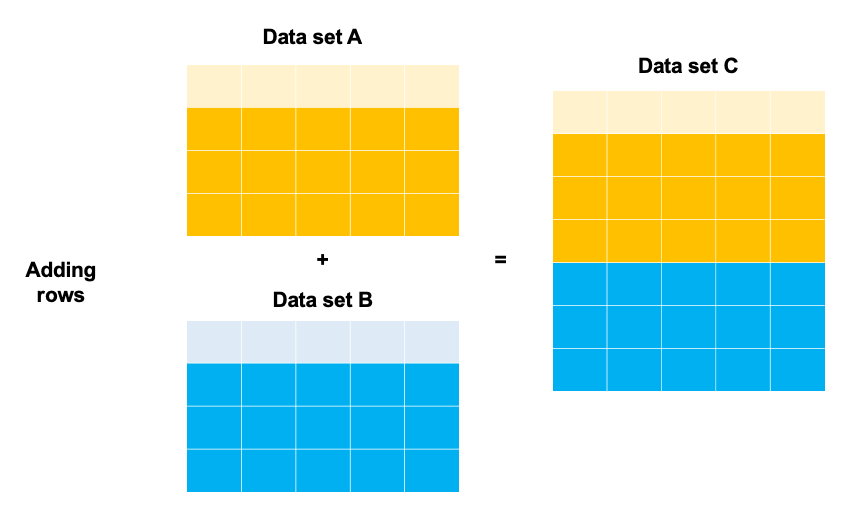
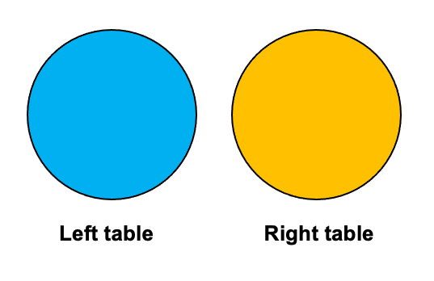
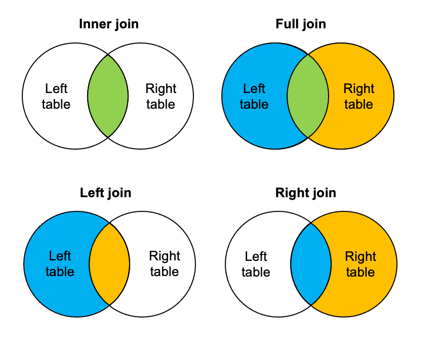
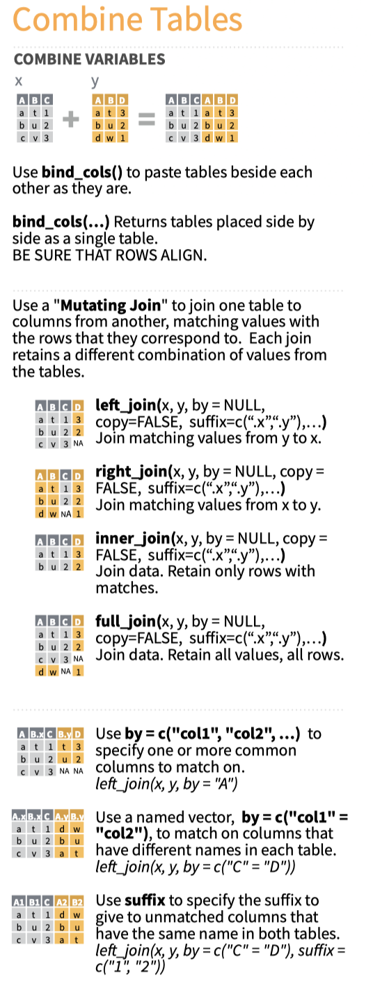

```{css, echo=FALSE}
p.caption {
  font-size: 0.9em;
  font-weight: bold;
  color: grey;
  margin-right: 10%;
  margin-left: 0%;  
  text-align: left;
}
```

```{r setup, include=FALSE, eval=TRUE}
library(learnr)
library(tidyverse)
library(lubridate)
library(scales)

checker <- function(label, user_code, check_code, envir_result, evaluate_result, ...) {
  list(message = check_code, correct = TRUE, location = "append")
}

tutorial_options(exercise.timelimit = 60, exercise.checker = checker)

knitr::opts_chunk$set(echo = FALSE)

# See this issue here: https://github.com/rstudio/learnr/issues/99
df_counts_basel <- readr::read_csv("https://drive.google.com/uc?id=18X-7Sevy7pegtK2J-Rv-ieG8bpaJozxZ&export=download")
df_wetter_basel <- readr::read_csv("https://drive.google.com/uc?id=14ligSPsFPM0AOnlgQBUR6g90uq8AdZw4&export=download") %>%
  filter(Year==2019)

df_wetter_basel_filter <- df_wetter_basel %>%
  filter(Year==2019) %>%
  filter(!Month%in%c(6,7,8))

df_counts_basel_viaduct_month <- readr::read_csv("https://drive.google.com/uc?id=19iOPux0D-z17URCuQVuqTtI_TQCsrNOP&export=download") 

df_counts_basel_filter <- df_counts_basel_viaduct_month %>%
  filter(Year>=2019,Year<2021) %>%
  filter(!Month%in%c(2,3,4))

```


## Welcome
In this tutorial we will look at the merging of data sets in R. 

I will first cover some key concepts to consider when merging data. Once these concepts are covered, I 'll continue with some practicial examples.

## Why merge data?

Why would you like to merge data?

* Making your data set longer: adding rows to your data set.    
* Making your data set wider: adding columns to your data.

I illustrated these concepts in the figure below. The first figure outlines the concept of adding columns to your data set. By merging data set A with data set B, data set C is obtained.

```{r fig-adding-columns, echo = FALSE, out.width = "100%", fig.cap = "Adding columns to your data set"}

knitr::include_graphics("images/adding_columns.png")

```

```{r fig-adding-rows, echo = FALSE, out.width = "100%", fig.cap = "Adding rows to your data set"}



```


In general, but this is my opinion, what is best, depends on the purpose:

* If you would like to merge multiple data sets that contain similar data (e.g. traffic counts per year), appending the data sets (binding the rows), is the way to go.
* If you would like to conduct statistical tests or estimate models with variables present in different data sets, you will need to join the data sets. 
* If you would like to visualize data and visualize different measurements, merging rows is the way to go. In these cases, merging data sets row wise is preferred. More precisely, you would like to have **long** data. This will be covered in a separate tutorial.


## An example

We would like to analyze the relationship between cycling volume and temperature. To this end, we would need to two data sets:

1. A first data set containing the temperature and precipitation (rainfall) . I downloaded this data from Swiss Meteo [here](https://www.meteoschweiz.admin.ch/product/output/climate-data/homogenous-monthly-data-processing/data/homog_mo_BAS.txt){target="_blank"}.
2. The second data set contains the number of cyclists per month on the Viaductstrasse in Basel. The counts have been aggregated to monthly values and filter to only have the counts for 2019. I downloaded this data set from the open data portal of the canton of Basel [here](https://data.bs.ch/explore/dataset/100013/information/?sort=datetimefrom) and filtered, grouped and summarized the data with the script [here](https://github.com/mvaneggermond/OffeneDatenwerkstatt/blob/master/00_utilities/03_read_write_basel.R){target="_blank"}.


We can join these data sets using the `inner_join` function from the `dplyr` package and plot the results using the `ggplot` package. 

Have a look at the data set containing the temperature data below. 
```{r data_wetter, echo=FALSE,message=FALSE}
df_wetter_basel
```


Now, have a look at the data set containing the counts data below.  

```{r data_counts, echo=FALSE,message=FALSE}
df_counts_basel_viaduct_month
```

By merging these data sets using the `dplyr` verb `inner_join()` we can obtain the following data set:

```{r data_wetter_counts, echo=FALSE,message=FALSE}
dplyr::inner_join(df_counts_basel_viaduct_month,df_wetter_basel, by=c("Year"="Year","Month"="Month")) %>% 
  filter(Year=='2019')
```

With this merged data set, we can create plot that visualizes 

```{r dual_plot_wetter, echo=FALSE,message=FALSE}
# Dual axis plot with ggplot: https://stackoverflow.com/questions/3099219/ggplot-with-2-y-axes-on-each-side-and-different-scales
# A better solution can be found here: https://stackoverflow.com/questions/58774705/y-limits-for-ggplot-with-sec-axis
df_join_counts_wetter <- dplyr::inner_join(df_counts_basel_viaduct_month,df_wetter_basel, by=c("Year"="Year","Month"="Month")) %>% 
  filter(Year=='2019')


#min(df_join_counts_wetter$total_cyclists)
#max(df_join_counts_wetter$total_cyclists)
#min(df_join_counts_wetter$Temperature)
#max(df_join_counts_wetter$Temperature)


ylim.prim <- c(140000, 260000)   # in this example, precipitation
ylim.sec <- c(0,20)    # in this example, temperature


b <- diff(ylim.prim)/diff(ylim.sec)
a <- ylim.prim[1] - b*ylim.sec[1] # there was a bug here
options(scipen=10000)

ggplot(df_join_counts_wetter, aes(year_month, total_cyclists)) +
  geom_col() +
  geom_line(aes(y = a + Temperature*b), color = "red") +
  scale_y_continuous("Cyclists [month]", sec.axis = sec_axis(~ (. - a)/b, name = "Temperature [Celsius]"))+
  scale_x_date(date_labels = "%b-%Y",breaks = date_breaks("1 month"))+
  theme_bw()  +
  theme(axis.text.x=element_text(angle=90,hjust=1)) +
  xlab("\nMonth")

```

Prior to showing how you can actually join using `dplyr`, we will look some key concepts.

## Key concepts

The underlying concept when **joining** data is that you aim to combine **matching** rows together from two different tables. In other words, we are looking for the **overlap** between different tables.**Matching** and **overlap** are the key words. This match is obtained by identifying columns that indicate overlap between different tables. Looking at the previous example, we saw that both tables contained the columns **month** and **year**. By matching the tables on these columns, a **join** between two tables is obtained. 

Now, suppose we have two tables, named **Left table** and **Right table**, as indicated by the circles in the figure below. 

```{r fig-two_tables, echo = FALSE, out.width = "50%", fig.cap = "Two tables"}



```

We are looking for the overlap between these two tables. As a starting point, we will consider four types of overlap:

* **Inner join**: With an inner join, only overlapping rows between the left and right table are returned
* **Left join**: With a left join, all rows of the left table will be returned and overlapping rows of the right table
* **Right join**: With a right join, all rows of the right table will be returned and overlapping rows of the left table
* **Full join**: With a full join, all rows of the left table and all rows of the right table will be returned


```{r fig-joins, echo = FALSE, out.width = "100%", fig.cap = "Type of joins"}



```

Let's look at the inner join in the next section!

## Inner join

If we want to keep only the rows that have information in both the left and right table, an `inner_join()` is used. You can think of this as an intersection between two data sets. 

Have a look at the code below in which two tables are joined, namely the table `df_counts_basel_viaduct_month` and the table `df_wetter_basel`. If you closely at the code, you will note that the function `inner_join` takes two arguments. These arguments are the names of the left table and the right table we would like to join. Go ahead, and execute the code.

```{r join-no-name, exercise = TRUE, exercise.eval = FALSE, results = "asis"}
# Join the table df_counts_basel_viaduct_month and df_wetter_basel
df_join_counts_wetter <- dplyr::inner_join(df_counts_basel_viaduct_month,df_wetter_basel) 
# Show the results
df_join_counts_wetter

```

Now, the curiously minded will think, how is it possible that `dplyr` knows where these two data sets overlap (intersect) each other. If you look closely at the message, you will note see the following `Joining, by = c("Year", "Month")`. `dplyr` identifies overlapping columns name and joins by these column names. 

### Specifying column names

It is better to specify the columns explicitly to avoid joining on columns that match in name, but actually do not indicate an overlap between data sets. 

If the column names between two different sets are the same, you can add the argument `by=c("matching_variable_1","matching_variable_2" )` to `inner_join()`, as shown in the code below. You specify a vector of matching column names to join. Do not forget the `""` surrounding the column names! 

```{r join-with-name, exercise = TRUE, exercise.eval = FALSE, results = "asis"}
# Join the table df_counts_basel_viaduct_month and df_wetter_basel
df_join_counts_wetter <- dplyr::inner_join(df_counts_basel_viaduct_month,df_wetter_basel, by = c("Year", "Month")) 
# Show the results
df_join_counts_wetter

```

If the column names between two different sets are not the same, you can further specify the column names. The `by` argument then looks as follows:  `by=c("left_matching_variable_1"="right_matching_variable_1","left_matching_variable_2"="right_matching_variable_2" )` to `inner_join()`, as shown in the code below. You specify a vector of matching column names to join. Do not forget the `""` surrounding the column names! 

```{r join-with-left-right-name, exercise = TRUE, exercise.eval = FALSE, results = "asis"}
# Join the table df_counts_basel_viaduct_month and df_wetter_basel
df_join_counts_wetter <- dplyr::inner_join(df_counts_basel_viaduct_month,df_wetter_basel, by=c("Year"="Year","Month"="Month")) %>% 
  filter(Year=='2019')
# Show the results
df_join_counts_wetter
```

### Importance of data types
In all cases, you need to make sure that the data types are the same of the column names you would like to join on, otherwise you will receive an error. 

In the example below I add a variable `Year_String` to the data set and join on the column `Year_String`. Give it a try and look at the error message. 

```{r join-error, exercise = TRUE, exercise.eval = FALSE,results = "asis"}
df_counts_basel_viaduct_month_str <- df_counts_basel_viaduct_month %>%
  dplyr::mutate(Year_String=as.character(Year))
# Join the table df_counts_basel_viaduct_month and df_wetter_basel
df_join_counts_wetter <- dplyr::inner_join(df_counts_basel_viaduct_month_str,df_wetter_basel, by = c("Year_String"="Year", "Month")) 
# Show the results
df_join_counts_wetter

```

## Left / right join

Suppose we would like to keep all rows from the left table, and only add information from the right table where this information is available.

This is called a `left_join()`. The function works exactly the same as the `inner_join()`.

To explain the `left_join()`, I filtered the data set with the temperatures to exclude some months. Let's join the tables using a `left_join()` and see which months are missing!

```{r left-join, exercise = TRUE, exercise.eval = FALSE,results = "asis"}

# Join the table df_counts_basel_viaduct_month and df_wetter_basel
df_left_join_counts_wetter <- dplyr::left_join(df_counts_basel_viaduct_month,df_wetter_basel_filter, by = c("Year", "Month")) 
# Show the results
df_left_join_counts_wetter

```

Indeed, the months June, July and August are missing from the merged data set, as indicated the `NA` values in the columns `Temperature` and `Precipitation`. 

Nevertheless, a left join canbe useful. For instance, we can still plot the values 

```{r dual_plot_wetter_left, echo=FALSE,message=FALSE}
# Dual axis plot with ggplot: https://stackoverflow.com/questions/3099219/ggplot-with-2-y-axes-on-each-side-and-different-scales
# A better solution can be found here: https://stackoverflow.com/questions/58774705/y-limits-for-ggplot-with-sec-axis
df_left_join_counts_wetter <- dplyr::left_join(df_counts_basel_viaduct_month,df_wetter_basel_filter, by = c("Year", "Month")) 

ylim.prim <- c(140000, 260000)   # in this example, precipitation
ylim.sec <- c(0,20)    # in this example, temperature


b <- diff(ylim.prim)/diff(ylim.sec)
a <- ylim.prim[1] - b*ylim.sec[1] # there was a bug here
options(scipen=10000)

ggplot(df_left_join_counts_wetter, aes(year_month, total_cyclists)) +
  geom_col() +
  geom_line(aes(y = a + Temperature*b), color = "red") +
  scale_y_continuous("Cyclists [month]", sec.axis = sec_axis(~ (. - a)/b, name = "Temperature [Celsius]"))+
  scale_x_date(date_labels = "%b-%Y",breaks = date_breaks("1 month"))+
  theme_bw()  +
  theme(axis.text.x=element_text(angle=90,hjust=1)) +
  xlab("\nMonth")

```


### Right join

Suppose we would like to keep all rows from the right table, and only add information from the left table where this information is available.

This is called a `right_join()`. The function works exactly the same as the `inner_join()`.

To explain the `right_join()`, I filtered the data set with the counts to exclude some months. Let's join the tables using a `right_join()` and see which months are missing!

```{r right-join, exercise = TRUE, exercise.eval = FALSE,results = "asis"}

# Join the table df_counts_basel_viaduct_month and df_wetter_basel
df_right_join_counts_wetter <- dplyr::right_join(df_counts_basel_filter,df_wetter_basel, by = c("Year", "Month")) 
# Show the results
df_right_join_counts_wetter

```

Indeed, the months February, March and April are missing from the merged data set, as indicated the `NA` values in the columns `total_cyclists` and `SiteName`. 

Nevertheless, a right join can be useful. For instance, we can still plot the values 

```{r dual_plot_wetter_right, echo=FALSE,message=FALSE}
# Dual axis plot with ggplot: https://stackoverflow.com/questions/3099219/ggplot-with-2-y-axes-on-each-side-and-different-scales
# A better solution can be found here: https://stackoverflow.com/questions/58774705/y-limits-for-ggplot-with-sec-axis
df_right_join_counts_wetter <- dplyr::right_join(df_counts_basel_filter,df_wetter_basel, by = c("Year", "Month")) 

ylim.prim <- c(140000, 260000)   # in this example, precipitation
ylim.sec <- c(0,20)    # in this example, temperature


b <- diff(ylim.prim)/diff(ylim.sec)
a <- ylim.prim[1] - b*ylim.sec[1] # there was a bug here
options(scipen=10000)

ggplot(df_right_join_counts_wetter, aes(year_month, total_cyclists)) +
  geom_col() +
  geom_line(aes(y = a + Temperature*b), color = "red") +
  scale_y_continuous("Cyclists [month]", sec.axis = sec_axis(~ (. - a)/b, name = "Temperature [Celsius]"))+
  scale_x_date(date_labels = "%b-%Y",breaks = date_breaks("1 month"))+
  theme_bw()  +
  theme(axis.text.x=element_text(angle=90,hjust=1)) +
  xlab("\nMonth")

```


## Full join

The final join I would like to present is the `full_join()`. If you would like to keep all the rows and fill the missing parts with `NA`, you can use `full_join()`. 

Have a look at the code below and the plot

```{r full-join, exercise = TRUE, exercise.eval = FALSE,results = "asis"}

# Join the table df_counts_basel_viaduct_month and df_wetter_basel
df_full_join_counts_wetter <- dplyr::full_join(df_counts_basel_filter,df_wetter_basel_filter, by = c("Year", "Month")) 
# Show the results
df_full_join_counts_wetter

```

```{r dual_plot_wetter_full, echo=FALSE,message=FALSE}
# Dual axis plot with ggplot: https://stackoverflow.com/questions/3099219/ggplot-with-2-y-axes-on-each-side-and-different-scales
# A better solution can be found here: https://stackoverflow.com/questions/58774705/y-limits-for-ggplot-with-sec-axis
df_full_join_counts_wetter <- dplyr::full_join(df_counts_basel_filter,df_wetter_basel_filter, by = c("Year", "Month")) 

ylim.prim <- c(140000, 260000)   # in this example, precipitation
ylim.sec <- c(0,20)    # in this example, temperature


b <- diff(ylim.prim)/diff(ylim.sec)
a <- ylim.prim[1] - b*ylim.sec[1] # there was a bug here
options(scipen=10000)

ggplot(df_full_join_counts_wetter, aes(year_month, total_cyclists)) +
  geom_col() +
  geom_line(aes(y = a + Temperature*b), color = "red") +
  scale_y_continuous("Cyclists [month]", sec.axis = sec_axis(~ (. - a)/b, name = "Temperature [Celsius]"))+
  scale_x_date(date_labels = "%b-%Y",breaks = date_breaks("1 month"))+
  theme_bw()  +
  theme(axis.text.x=element_text(angle=90,hjust=1)) +
  xlab("\nMonth")

```


## Pitfalls

To merge data sets, you cannot avoid using joins. However, there are some important pitfalls to be beware of.

It will occur occasionally occur that your left or right data set has observations occurring more often than you expect or you forget to specify an essential variable when joining . It is good practice to check the number of rows of your data set before and after joining to see whether something unexpected happens. 

Have a look at the example below. In this case, I omitted the column `Month` from the join. In this case, every row with a matching year will be returned. In this case, every row of the data set containing weather data for 2019 will returned 12 times, resulting in 12*12 rows being returned!


```{r example-join-rows, exercise = TRUE, exercise.eval = FALSE,results = "asis"}
# Input 1
nrow(df_counts_basel_viaduct_month_viaduct)
# Input 2
nrow(df_wetter_basel)

# Join the table df_counts_basel_viaduct_month and df_wetter_basel
df_year_join_counts_wetter <- dplyr::inner_join(df_counts_basel_viaduct_month_viaduct,df_wetter_basel, by = c("Year")) 

# Number of rows from the join
nrow(df_year_join_counts_wetter)
# Show the results
df_year_join_counts_wetter
```


## Binding rows


## Binding columns


## Summary

The dplyr data transformation cheat sheet provides a nice visual synopsis of the 

```{r fig-cheat-sheet-variables, echo = FALSE, out.width = "100%", fig.cap = "Excerpt from dpyr's cheat sheet"}



```


